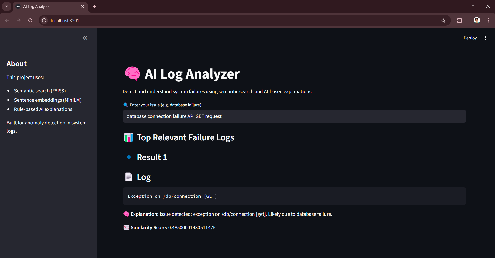
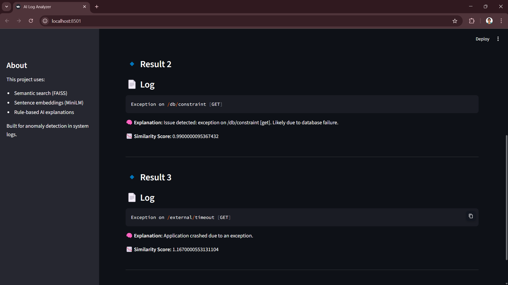

# AI Log Analyzer

AI-powered log analysis using semantic search and embeddings to detect and explain system failures.

---

## Features

- Semantic search using FAISS
- Log retrieval using embeddings (MiniLM)
- Rule-based explanation system
- Interactive Streamlit dashboard

---

## Tech Stack

- Python
- Streamlit
- LangChain
- FAISS
- HuggingFace Transformers

---

## Demo



---

## Run Locally

```bash
pip install -r requirements.txt
streamlit run app.py
